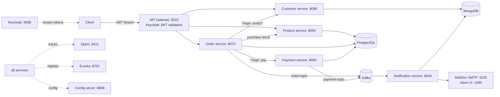

# Local Business — E-Commerce Microservices Platform

An event-driven microservices platform for a local business's online ordering: customers, product catalog, orders, payments, and email notifications — fronted by an API gateway with Keycloak (OAuth2/JWT) security and full distributed tracing.

> **Project status:** all core services implemented and working end-to-end from the IDE against the composed infrastructure. Deployment-readiness work (containerizing the services, removing hardcoded credentials, service-to-service security, tests/CI, performance) is tracked in prioritized GitHub issues (#1–#6).

## What it does / purpose it serves

A realistic reference implementation of a small commerce backend: a customer places an order through the gateway; the order service verifies the customer, purchases stock from the product service, records the order, triggers payment; order and payment events flow over Kafka to the notification service, which emails confirmations. Every request is traceable in Zipkin.

## Architecture

| Service | Port | Stack / store | Responsibility |
|---|---|---|---|
| api-gateway | 8222 | Spring Cloud Gateway + OAuth2 resource server (Keycloak) | Single entry point, JWT validation, routing via Eureka |
| config-server | 8888 | Spring Cloud Config (native) | Centralized configuration for all services |
| discovery-server | 8761 | Eureka | Service registry |
| customer | 8090 | Spring Boot / MongoDB | Customer CRUD, existence checks for ordering |
| product | 8050 | Spring Boot / PostgreSQL + Flyway | Catalog, stock validation and purchase |
| order | 8070 | Spring Boot / PostgreSQL, OpenFeign, Kafka producer | Order orchestration across customer/product/payment |
| payment | 8060 | Spring Boot / PostgreSQL, Kafka producer | Payment records, payment events |
| notification | 8040 | Spring Boot / MongoDB, Kafka consumer, Thymeleaf mail | Persists notifications, sends confirmation emails |

Infrastructure (docker-compose): PostgreSQL, MongoDB, Kafka + Zookeeper, Keycloak 24, Zipkin, MailDev (SMTP test inbox), PgAdmin, Mongo Express.

## Major decisions and why

- **Config server distributes structure, not secrets** — service configs are centralized; credentials move to environment variables (issue #1).
- **Polyglot persistence** — document store for customer/notification profiles, relational + Flyway for order/product/payment where transactional integrity and migrations matter.
- **Kafka for the notification path** — confirmations are asynchronous and must not block or fail order/payment writes.
- **Security at the edge first** — Keycloak JWT validation at the gateway; extending enforcement into each service and propagating identity between services is issue #3.
- **Synchronous orchestration for order creation** — simple and debuggable at this scale; resilience (timeouts, circuit breakers) is added in issue #5 rather than jumping to sagas prematurely.

## Data flow



## Running locally

Prerequisites: JDK 17, Maven, Docker Desktop.

```bash
# 1. Infrastructure
docker compose up -d

# 2. Start services in order (each: mvn spring-boot:run in services/<name>)
#    config-server -> discovery-server -> customer, product, payment, notification, order -> api-gateway

# 3. Verify
#    Eureka:  http://localhost:8761      Zipkin:  http://localhost:9411
#    MailDev: http://localhost:1080      Keycloak: http://localhost:9098
```

One-command containerized startup for all services is tracked in issue #2.

## Environment variables

After issue #1 lands, all of these come from a git-ignored `.env` (see `.env.example`):

| Variable | Purpose |
|---|---|
| `POSTGRES_USER` / `POSTGRES_PASSWORD` | PostgreSQL credentials (shared instance: order, payment, product DBs) |
| `MONGO_USER` / `MONGO_PASSWORD` | MongoDB credentials (customer, notification DBs) |
| `KEYCLOAK_ADMIN` / `KEYCLOAK_ADMIN_PASSWORD` | Keycloak bootstrap admin |
| `MAIL_USERNAME` / `MAIL_PASSWORD` | SMTP credentials (MailDev locally; real provider in prod) |
| `KEYCLOAK_ISSUER_URI` | JWT issuer validated by the gateway |
| `TRACING_SAMPLING` | Zipkin sampling probability (default 0.1 outside dev) |

## Deployment

Target: **containerized stack + env vars only** (issue #2).

1. `cp .env.example .env` and set real values.
2. `docker compose up --build` — infrastructure and all eight services with healthcheck-ordered startup and an auto-imported Keycloak realm.
3. Smoke test: obtain a token from Keycloak → create customer → create order → confirm emails in the mail provider and traces in Zipkin.

## Open work (impact-ordered)

See the [issue tracker](../../issues): #1 secrets/env externalization, #2 full containerization, #3 end-to-end security, #4 tests + CI, #5 inter-service reliability/consistency, #6 pooling/caching/load-testing.
